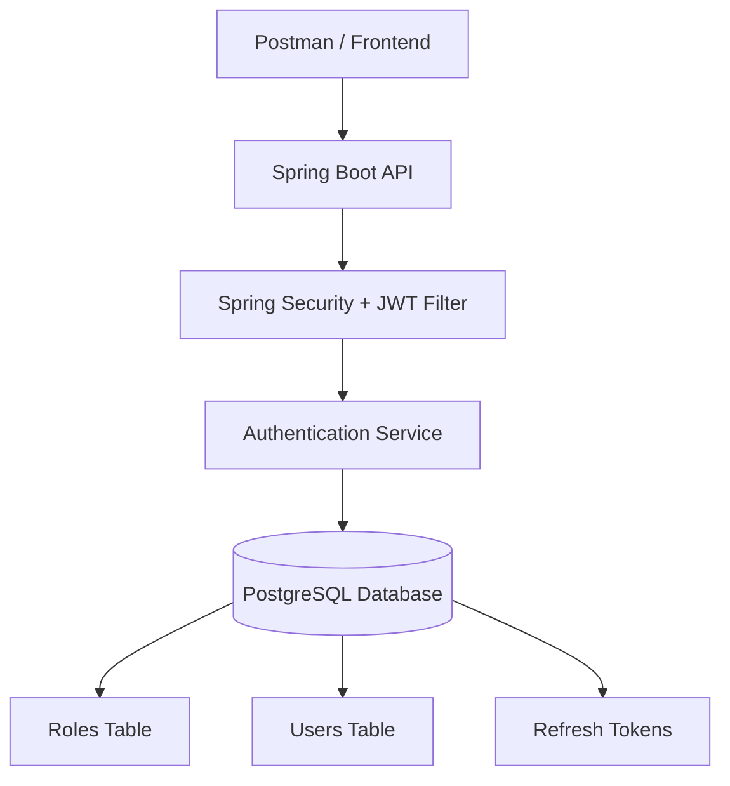
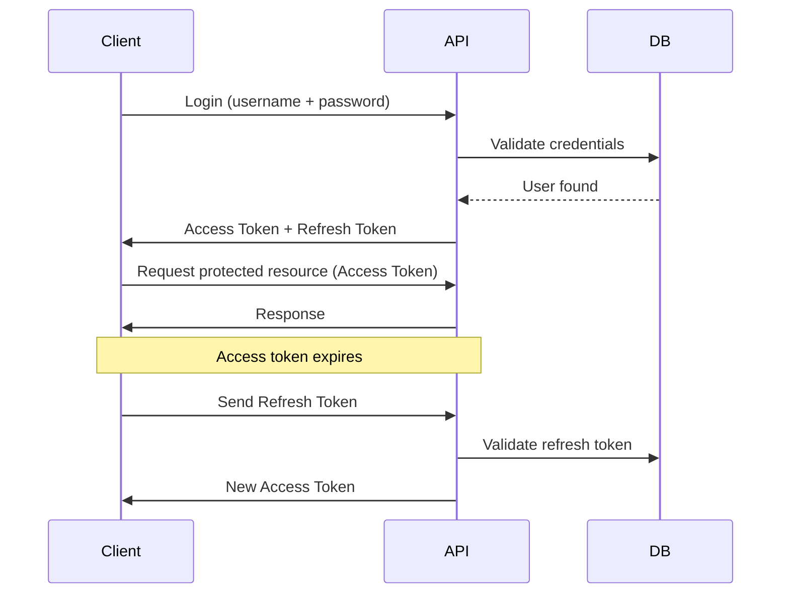

# User Authentication & Authorization System

A production-style authentication backend built with **Spring Boot, JWT, PostgreSQL, and Docker**.  
The system supports **secure user registration, login, role-based authorization, and refresh token management**.

## Tech Stack

- **Java 21**
- **Spring Boot**
- **Spring Security**
- **JWT (JSON Web Tokens)**
- **PostgreSQL**
- **Docker & Docker Compose**
- **JPA / Hibernate**
- **BCrypt Password Encoding**

---

## Features

- User registration and login
- JWT-based authentication
- Refresh token mechanism
- Role-based access control (USER / ADMIN)
- Account lock on repeated failed login attempts
- Password hashing using BCrypt
- Dockerized backend and PostgreSQL database
- Automatic role initialization on startup

---

## Project Structure
src
├── controller
├── service
├── repo
├── model
├── security
├── config
├── dto
└── Application.java

---

## Running the Project

### Using Docker (recommended)

```bash
docker compose up --build
```
---


Application will start at:
http://localhost:8080

---

| Method | Endpoint             | Description           |
| ------ | -------------------- | --------------------- |
| POST   | `/api/auth/register` | Register new user     |
| POST   | `/api/auth/login`    | Login and receive JWT |
| POST   | `/api/auth/refresh`  | Refresh access token  |

---

Security Features:-

1)Password hashing with BCrypt

2)JWT access tokens for stateless authentication

3)Refresh tokens stored in database

4)Role-based authorization

5)Protection against brute-force login attempts

6)Account lock mechanism after failed attempts

---

Future Improvements:-

1)Email verification

2)Password reset flow

3)Redis for refresh token storage

---

Author:-Rehan Khatkar

---
## System Architecture


---
## JWT Token Lifecycle


---

## Security Design

The authentication system implements several security best practices:

- **Password Encryption**
  - User passwords are hashed using BCrypt before storage.

- **Stateless Authentication**
  - JWT tokens eliminate the need for server-side session storage.

- **Refresh Token Mechanism**
  - Short-lived access tokens combined with long-lived refresh tokens.

- **Role-Based Authorization**
  - Users are assigned roles such as `ROLE_USER` and `ROLE_ADMIN`.

- **Account Protection**
  - Failed login attempts are tracked and accounts can be temporarily locked.

- **Secure Token Validation**
  - JWT tokens are validated on every request using a security filter.
